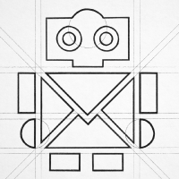
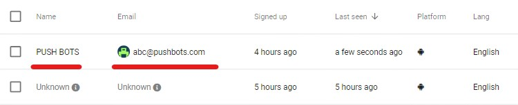
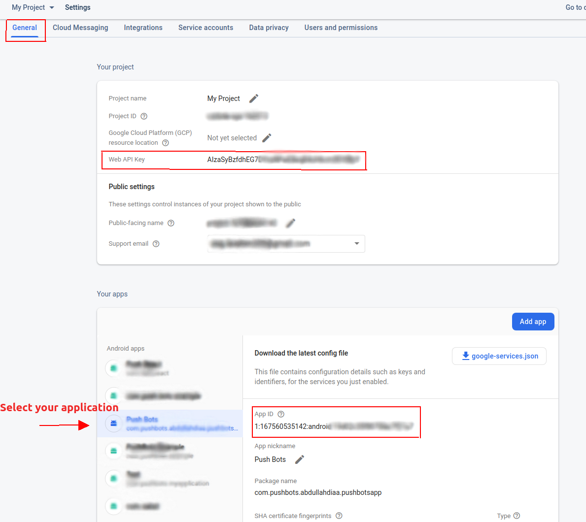

<<<

== Android SDK Setup

https://pushbots.com[PushBots] Android SDK setup guide.

<<<
== What we do?
https://pushbots.com[PushBots] is a push notification service that help you manage notifications on all platforms
(Android, iOS, Web, react-native, cordova) efficiently and easily.

<<<
== Required For Setup:-
   - A https://pushbots.com[PushBots] account
       * You will find APP_ID while integrating your project with dashboard
   - An https://www.pushbots.help/en/articles/498201-the-google-part-firebase-server-key-and-sender-id[API-KEY and SENDER-ID] from FCM (Firebase notification messaging)
   - https://developer.android.com/studio[Android Studio]

<<<
== Setup PushBots
=== 1. Adding PushBots Dependencies

[source,groovy]
.build.gradle
----
implementation 'com.pushbots:pushbots-lib:3.2.8@aar'
implementation 'com.google.firebase:firebase-messaging:20.0.1'
implementation 'com.google.android.gms:play-services-location:17.0.0'
----

=== 2. Integrate with PushBots dashboard
Add to defaultConfig section, then replace PUSHBOTS_APP_ID and GOOGLE_SENDER_ID
[source,groovy]
.build.gradle
----
defaultConfig {
        // Add PushBots integration data
        manifestPlaceholders = [
                pushbots_app_id               : "YOUR_APP_ID",
                pushbots_loglevel             : "DEBUG",
                google_sender_id              : "YOUR_SENDER_ID"
        ]

    }
----

=== 3. Initialize PushBots
PushBots should be initialized when app just started, one of the existing ways is to initialize it in our application.

[source, kotlin]
.MyApplication.kt
----
import android.app.Application
import com.pushbots.push.Pushbots

class MyApplication : Application() {
   override fun onCreate() {
        super.onCreate()
        // Initialize Pushbots Library
        Pushbots.sharedInstance().init(this)
   }
}
----

Now add your Application to Manifest.xml
[source,xml]
.AndroidManifest.xml
----
 <application
     android:name=".MyApplication">
 </application>
----

// 

<<<

Now you have initialized PushBots *successfully*, BUT there is one more step to be able to receive notifications.

You need to register for it (You may register for it inside you MyApplication.class or MainActivity.class):
[source,kotlin]
.MainActivity.kt
----
//Register for Push Notifications
Pushbots.sharedInstance().registerForRemoteNotifications()
----

<<<
== Things you can do using PushBots:-

- You can set device info so you can recognize/manage users on dashboard easily i.e:

[source,kotlin]
.MainActivity.kt
----
Pushbots.setEmail("abc@pushbots.com")
Pushbots.setName("PUSH BOTS")
Pushbots.setAlias("PUSHER")
----
<<<
Now you can manage users easily on dashboard.

<<<

== Use our plugin to fix dependencies conflicts

- Using the https://docs.gradle.org/current/userguide/plugins.html#sec:plugins_block[plugins DSL]

[source, groovy]
----
plugins {
  id "com.pushbots.android.plugin.pushbots-gradle-plugin" version "1.0-SNAPSHOT"
}
----

<<<
<<<
<<<
<<<

- Using legacy https://docs.gradle.org/current/userguide/plugins.html#sec:old_plugin_application[plugin application]:

[source, groovy]

----
buildscript {
  repositories {
   maven { url "https://plugins.gradle.org/m2/" }
  }

// Inside your app.build.gradle
dependencies {
   classpath "gradle.plugin.com.pushbots:pushbots-gradle-plugin:1.0-SNAPSHOT"
  }
}

apply plugin: "com.pushbots.android.plugin.pushbots-gradle-plugin"

----
<<<

== How to get Web-Api-Key and App-id

You will need to provide Web-Api-Key and App-Id while initializing Pushbots:-

*`Pushbots.sharedInstance().init(context, webApiKey, fcmAppId);`*

<<<
== AndroidX Migration
If your project is using AndroidX you will need to make sure Jetifier is enabled to be compatible with PushBots.
In your gradle.properties file, set the following two flags to true

[source,groovy]
.gradle.properties
----
android.useAndroidX=true
android.enableJetifier=true
----
<<<

